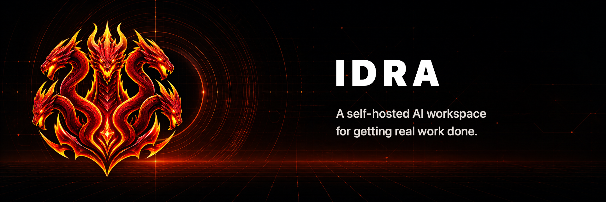

# Idra

Idra is a self-hosted AI agent exposed only through the [A2A 1.0 protocol](https://a2a-protocol.org/v1.0.0/specification/). The server has no browser console, legacy messaging endpoint, or remote configuration API. A2A clients can discover it, send or stream messages, continue contexts, inspect tasks, and cancel active work.

## Deploy with Docker Compose

Docker Compose is the supported server installation. It pins the runtime, runs Idra as a non-root user, keeps the application filesystem read-only, and stores durable state in a named volume.

You need Docker with Docker Compose, an API key for Anthropic, OpenAI, or DeepSeek, and an HTTPS hostname for production.

```bash
git clone https://github.com/HaraldBregu/idra.git
cd idra
cp .env.example .env
openssl rand -hex 32
chmod 600 .env
```

Put the generated token and provider settings in `.env`:

```dotenv
IDRA_PUBLIC_URL=https://agent.example.com
IDRA_AGENT_TOKEN=<generated-token>
IDRA_PROVIDER_ID=openai
IDRA_MODEL_ID=<current-model-id>
IDRA_API_KEY=<provider-api-key>
```

`IDRA_PUBLIC_URL` is the public origin, without `/a2a` or a trailing path. It must use HTTPS except for loopback development. `IDRA_AGENT_TOKEN` must contain at least 32 UTF-8 bytes. `IDRA_BASE_URL` and JSON-object `IDRA_MODEL_OPTIONS` are optional.

Validate and start the service:

```bash
docker compose config --quiet
docker compose up --build --wait -d
```

Compose binds `127.0.0.1:3000` by default. Terminate TLS at a reverse proxy and forward the public hostname to that address. For example, a Caddy site can use:

```caddyfile
agent.example.com {
	reverse_proxy 127.0.0.1:3000 {
		flush_interval -1
	}
}
```

Keep SSE buffering disabled and choose a proxy idle timeout long enough for agent runs.

## Use the A2A interface

Discovery is public at:

```text
GET /.well-known/agent-card.json
```

All operations under `/a2a` require both headers:

```http
A2A-Version: 1.0
Authorization: Bearer <IDRA_AGENT_TOKEN>
```

For example, stream a prompt with an A2A HTTP+JSON request:

```bash
curl -N https://agent.example.com/a2a/message:stream \
  -H 'A2A-Version: 1.0' \
  -H 'Authorization: Bearer <IDRA_AGENT_TOKEN>' \
  -H 'Content-Type: application/a2a+json' \
  -H 'Accept: text/event-stream' \
  --data '{"message":{"messageId":"request-1","role":"ROLE_USER","parts":[{"text":"Summarize the workspace.","mediaType":"text/plain"}]}}'
```

Use the returned `contextId` in a later message to continue the same conversation. The official JavaScript SDK can discover Idra with `ClientFactory` and `RestTransportFactory` from `@a2a-js/sdk`.

Only the Agent Card and A2A routes are registered. `/`, `/access`, `/ui`, `/agents/messages`, `/provider`, `/storage`, `/mcp`, and `/health` are not available. The container health check uses the Agent Card endpoint.

## Data and capabilities

Idra stores its working data in the `idra-data` Docker volume. Recreating the container with `docker compose down` followed by `docker compose up --wait -d` keeps that volume and its contents. Do not add `--volumes` unless you intend to remove the stored data.

The workspace is `/data/workspace`. Its `AGENTS.md` file contains durable guidance for the agent. A2A requests can use only the workspace-bound `read`, `write`, and `edit` tools. Shell commands, MCP servers, subagents, and administrative operations are unavailable through the server channel.

Task records and conversations persist under `/data`, and terminal A2A tasks are retained for 30 days. Provider requests still send relevant prompt content to the configured model provider.

## Security

- Keep `.env` mode `0600` and never commit it.
- Use a dedicated, randomly generated A2A token and rotate it if exposed.
- Keep port 3000 on loopback and expose it only through an HTTPS reverse proxy.
- Anyone holding the single A2A token is the same trusted principal and can access every stored task and context.
- Back up and protect the Docker volume; it contains workspace and conversation data.
- Review your model provider's data-handling policy.

Stop or update the deployment with:

```bash
docker compose down
docker compose pull
docker compose up --build --wait -d
```

## Project

Idra is available under the [MIT License](LICENSE).

- Follow [Using Idra over A2A](USAGE.md) for prompts, continued conversations, task management, and official SDK examples.
- Learn how to set up the development environment and submit changes in [CONTRIBUTING.md](CONTRIBUTING.md).
- Read the supported versions, vulnerability scope, and private reporting process in [SECURITY.md](SECURITY.md).
