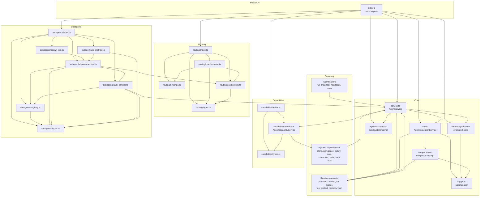

# Agent Module Graph

This graph is scoped to `src/main/agent` only. External app services are collapsed into boundary nodes so the diagram shows the agent module's internal files and subfolders.

Key reads:

- `service.ts` is the agent module orchestrator: it calls capability resolution, system prompt construction, before-run hooks, and the execution service.
- `run.ts` owns the model loop and calls `compaction.ts` when the provider reports context overflow.
- `capabilities/`, `routing/`, and `subagents/` are shown as internal agent submodules, with their own index files and type files.
- External services such as tools, connectors, skills, MCP, sessions, providers, and task runners are intentionally collapsed into boundary nodes because they live outside `src/main/agent`.
